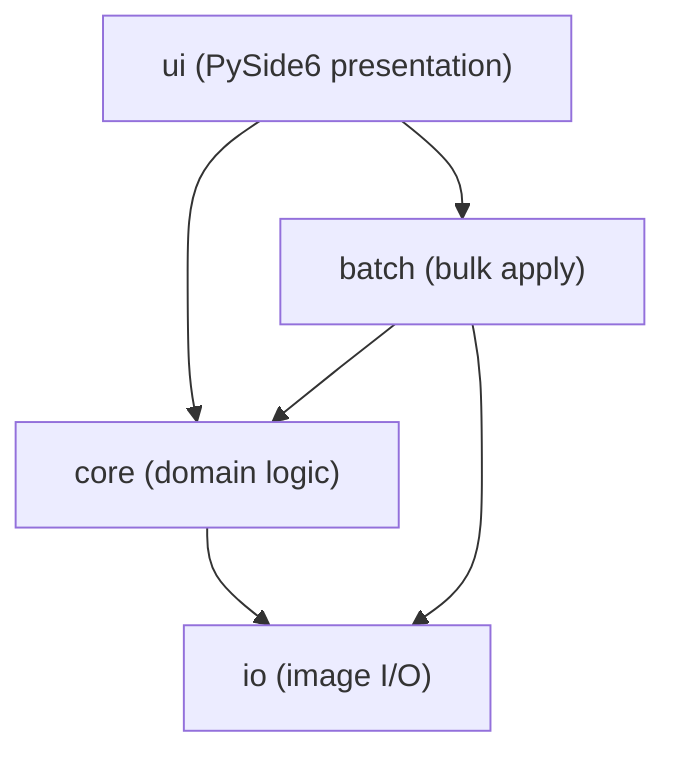
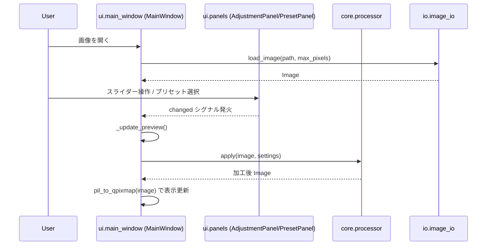
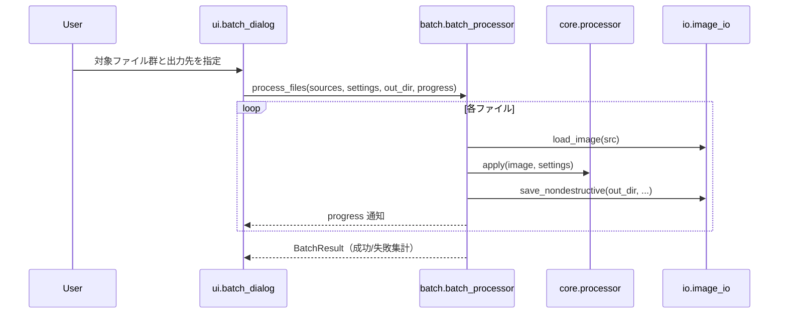
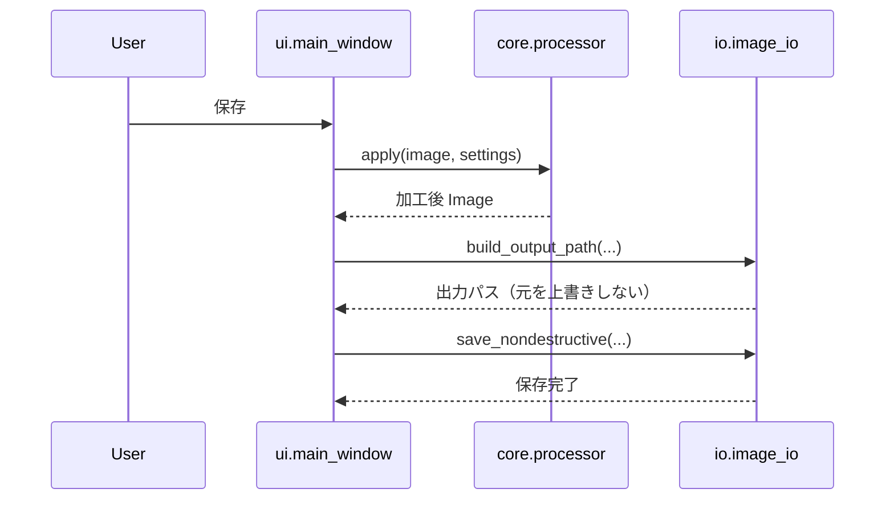

# アーキテクチャ

## システム概要

`screenshot-editor` は、単一プロセスのデスクトップアプリケーション（モジュラモノリス）。PySide6 による GUI を持ち、画像処理ロジックは GUI から独立した純粋モジュールとして分離されている。ネットワーク I/O やサーバ構成は持たない。

## アーキテクチャスタイル

- **モジュラモノリス**（レイヤードアーキテクチャ）。
- レイヤ間の依存は一方向: `ui -> core -> io`。`batch` は `core`/`io` を利用する。
- `core`/`io` は PySide6 を import しない（GUI 非依存。project.md の Mandated 準拠）。Pillow の `Image` は `io`/`core` 内に閉じ込め、`ui` は `pil_to_qpixmap` による QImage 変換の直前でのみ扱う。

## コンポーネント関係図

テキストフォールバック: `ui` は `core` と `batch` に依存する。`core` は `io` に依存する。`batch` は `core` と `io` に依存する。`io` は他レイヤに依存しない（最下層）。

## データフロー

- 編集値（調整・プリセット）は `ui` の各パネルから `EditSettings` に集約され、`core.processor.apply` が固定合成順（補正 → 画質 → フィルタ → トリミング/リサイズ → クレジット）で `Image` に適用する。
- 入出力は `io.image_io` が担い、`load_image` で安全にデコードし、`save_nondestructive` で別ファイルへアトミックに保存する。
- バッチは `batch.batch_processor.process_files` が複数ソースへ同一 `settings` を適用し `BatchResult` に集計する。

## Interaction Diagrams

### 画像を開く → 調整/プリセット → プレビュー更新

テキストフォールバック: ユーザーが画像を開くと `MainWindow` が `io.image_io.load_image` で読み込む。ユーザーがスライダー操作またはプリセット選択を行うとパネルが `changed` シグナルを発火し、`MainWindow._update_preview` が `core.processor.apply` を呼んで加工結果を得て `pil_to_qpixmap` で表示を更新する。**注**: この `changed` シグナル経路が現行 intent の不具合箇所（詳細は `code-quality-assessment.md`）。

### バッチ処理

テキストフォールバック: `batch_dialog` がユーザー指定を受け、`batch_processor.process_files` が各ファイルを `load_image` → `apply` → `save_nondestructive` の順に処理し、進捗を通知しつつ `BatchResult` を返す。

### 非破壊保存

テキストフォールバック: 保存時、`MainWindow` は `core.processor.apply` で加工し、`io.image_io.build_output_path` で元を上書きしない出力パスを決めてから `save_nondestructive` でアトミックに書き出す。

## 主要な設計上の決定

- **GUI とドメインロジックの分離**: `core`/`io` を PySide6 非依存に保つことで、テスト容易性と再利用性を確保。
- **非破壊 I/O**: 元画像を保護し、出力を別パスへアトミックに書き出す。
- **決定的な合成順**: `processor.apply` の適用順を固定し、再現性を担保。

## 改善余地

- `ui` 層に自動テストが存在せず、カバレッジ対象からも外れているため、シグナル配線・プレビュー経路のバグがゲートをすり抜ける（現行 intent がその例）。詳細は `code-quality-assessment.md`。
