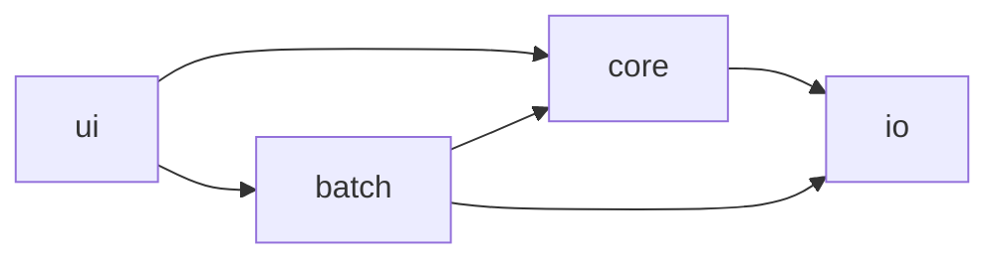

# 依存関係

## 外部依存（サードパーティ）

バージョンの一覧・詳細は `technology-stack.md` を参照。要点のみ:

- **ランタイム**: `PySide6==6.7.2`（`ui` のみ）, `Pillow==10.4.0`（`core`/`io`）。
- **開発/品質**: `pytest==8.3.2`, `pytest-cov==5.0.0`, `ruff==0.6.2`, `black==24.8.0`, `pre-commit==3.8.0`, `pyinstaller==6.10.0`。
- **ビルド/管理**: `uv`（lock 管理）, `hatchling`（build-system）。
- 固定は `app/pyproject.toml`、lock は `app/uv.lock`。外部 API・ネットワーク送信依存はなし。

## 内部クロスパッケージ依存

一方向依存で循環なし:

テキストフォールバック:

- `ui -> core`（編集設定・processor・presets を利用）
- `ui -> batch`（バッチダイアログ経由）
- `core -> io`（Pillow `Image` の入出力）
- `batch -> core`（`processor.apply`）
- `batch -> io`（`load_image` / `save_nondestructive`）
- `io` は他内部パッケージに依存しない（最下層）

## 依存上の制約（Mandated）

- `core`/`io` は PySide6 を import しない（GUI 非依存を維持）。
- Pillow の `Image` は `io`/`core` 内に閉じ込め、`ui` は `pil_to_qpixmap` の変換直前でのみ扱う。
