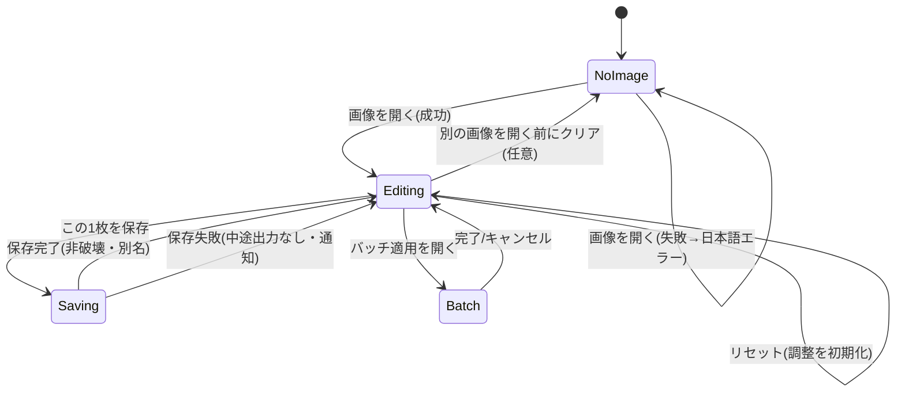

# Functional Spec — screenshot-editor（mvp）

技術非依存の振る舞い仕様。単一ユニット screenshot-editor（kind: ui）の、加工ワークフローと画面/加工状態の遷移を規定する。内部構造は ui→core→io の一方向依存 [components][team-practices]。

## 1. ドメインの状態（加工セッション）

編集セッションは次の論理状態を持つ。これは画面の状態であり、永続エンティティではない。

- **NoImage**: 画像未読込。プレビューは案内表示。
- **Editing**: 画像読込済み。加工設定 EditSettings を保持し、プレビューはその適用結果を表示。
- **Saving**: 保存処理中（通常は一瞬）。
- **Batch**: バッチ適用ダイアログ表示・実行中。

### 状態遷移（単体編集）

テキストフォールバック: 起動時 NoImage。開くと Editing（失敗時は NoImage のままエラー表示）。Editing 中は調整でプレビュー即時更新、リセットで初期化。保存すると一時 Saving を経て Editing に戻る（成功=非破壊別名、失敗=中途出力なし）。バッチ適用は Editing から開き、完了/キャンセルで Editing に戻る。

## 2. 主要ワークフロー

### WF1: 単体編集（US1.1〜US1.8）
1. 画像を開く（PNG/JPEG）。失敗時は日本語エラーを表示し WF 中断（AC1.1.2）。
2. プレビュー表示。左メニューでカテゴリ選択 → 右パネル切替（AC1.1.3）。
3. 調整（明るさ/コントラスト/彩度、シャープ/ぼかし/ノイズ除去、フィルタ、トリミング、リサイズ、クレジット）を行う。各操作は core に EditSettings を渡し、結果をプレビューに即時反映（AC1.2.x〜AC1.6.x）。
4. 必要ならリセットで全調整を初期化（AC1.8.x）。
5. 「この1枚を保存」→ 非破壊保存（同フォルダ・`_edited`接尾辞・元と同形式・一時ファイル→リネーム）（AC1.7.x）。

### WF2: 骨組み疎通（US0.1）
- 開く→（無加工）→保存 が ui→core→io を貫通。元画像はバイト列・mtime不変、PNG画素完全一致/JPEG許容誤差内（AC0.1.x）。WF1の最小経路として最初に成立させる。

### WF3: バッチ処理（US2.1）
1. Editing で加工設定を決めた後、バッチ適用ダイアログを開く。
2. フォルダまたは複数ファイルを選択、出力先を指定（既定=各元画像と同フォルダ`_edited`）。
3. 一括適用開始。各対象を 読込→core適用→非破壊保存。失敗はスキップ継続、進捗「n枚中m枚処理中…」表示（AC2.1.4）。
4. 完了時「成功n件／失敗m件（n+m=総数）」表示。全件失敗でもクラッシュしない（AC2.1.2, AC2.1.3）。

## 3. EditSettings（加工設定の論理シェイプ）

ImageProcessingCore が所有。単体編集・バッチで共有。属性（論理・技術非依存）:
- brightness / contrast / saturation（各: 中立値=0の相対調整、恒等で無変化）
- sharpen / blur / denoise（各: 強度、恒等=無変化）
- presetName（適用プリセット名。none=未適用）
- crop（矩形範囲。none=未適用）
- resize（目標寸法とアスペクト比保持フラグ。none=未適用）
- credit（テキスト、位置、サイズ、不透明度。empty=未付与）

> 型・制約の詳細はコード生成時に確定（本ユニットはui-kindでentities.md/rules.mdを持たないため、EditSettingsの論理シェイプはここに記す）。

## 3.5 加工の適用順序と設計判断（Q1/Q2/Q3）

- **リサイズ**: 既定でアスペクト比を保持する（解除も可能）[Q1]。
- **トリミング**: 自由な矩形選択とする（mvpでは固定比率プリセットは持たない）[Q2]。
- **最終合成の順序**: UI上は各加工を自由に何度でも調整できるが、最終的に画像へ焼き込む合成順序は固定の自然な順序（補正 → 画質 → フィルタ → トリミング/リサイズ → クレジット）とする [Q3]。
  - この判断の根拠（Q3で提示・合意）:
    - **メリット**: 同じ設定なら常に同じ出力になり結果が再現・一貫する（バッチ処理でも全画像が同一理屈で仕上がる）／実装・テストが単純でバグが少ない／クレジットを最後に載せるためリサイズで文字がぼけたり切れたりしない。
    - **デメリット**: 「フィルタの前にトリミング」等、合成順序を入れ替える特殊な表現はできない。
    - **却下した代替（順序も自由に変更可）**: 表現の自由度は最大だが、実装・テストが大きく複雑化しmvp範囲を超える／結果の予測・再現が難しくバッチで意図しない仕上がりになりやすい／「多彩な加工を手軽に」という狙いに反して操作が難しくなる。順序変更の自由度は将来拡張の候補として残す。

## 4. エラー・エッジケースの振る舞い

- 破損/非対応/0バイト入力: 入力境界で早期検出、日本語メッセージに変換、アプリ継続（fail fast）[team-practices]。
- 保存失敗: 一時ファイル→リネーム方式で中途出力を残さない。
- リサイズ境界（1px・極端な寸法）: クラッシュしない。
- 恒等操作: 各変換は恒等パラメータで入力と一致（決定的）。

## 5. Business Scenarios（受け入れの筋）

- Happy: スクショを開く→補正・トリミング・クレジット→保存→別ファイルができ元は無変更。
- Happy(batch): 設定を決める→フォルダ選択→一括保存→件数表示。
- Unhappy: 壊れた画像を開く→エラー表示・継続。バッチに壊れ画像混在→スキップして継続・件数に反映。

## Assumptions & Open Questions

- 各調整の値域・刻み、JPEG許容誤差、プリセットの具体内容は code-generation の計画で確定する。
