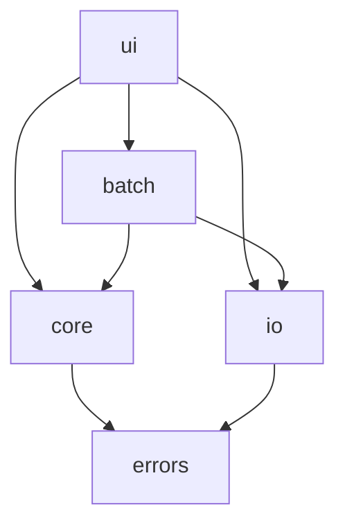

# Logical Components (NFR view) — screenshot-editor（mvp）

domain-design の4コンポーネントを、選定スタック（Python/PySide6/Pillow）上の論理モジュールへマッピングし、NFR設計（性能・セキュリティ）の観点を重ねる。

## モジュール構成（ui→core→io）

```
screenshot_editor/
├─ ui/            (PySide6)      … AppUI: MainWindow, パネル群, BatchDialog
├─ core/          (純粋Python)   … ImageProcessingCore: EditSettings, 各変換, プリセット
├─ io/            (Pillow)       … ImageIO: load/verify, フォーマット判定, 非破壊保存
├─ batch/         (Python)       … BatchProcessor: 反復・集計・進捗（ワーカースレッド）
└─ errors.py                     … 型付きドメインエラー
```

## コンポーネント × NFR

| コンポーネント | 性能設計 | セキュリティ設計 |
|---------------|---------|-----------------|
| ui (AppUI) | 縮小プレビューで即時反映、重処理はワーカーへ | エラーを日本語メッセージへ変換して表示 |
| core (ImageProcessingCore) | 決定的・純粋関数、縮小/原寸両対応 | 状態を持たずスレッド安全、外部I/Oなし |
| io (ImageIO) | 遅延ロード・1パス書き出し | 安全デコード（verify/上限）、アトミック保存、パス正規化 |
| batch (BatchProcessor) | 1枚ずつ処理・進捗シグナル | 各対象を未検証データ扱い、失敗スキップ継続 |

## 依存（一方向）



テキストフォールバック: ui は core/io/batch を呼ぶ。batch は core/io を呼ぶ。core と io は errors を使う。逆方向依存なし。

## Assumptions & Open Questions

- 物理的なパッケージ名・ファイル分割の詳細はコード生成で確定（この構成を基本とする）。
