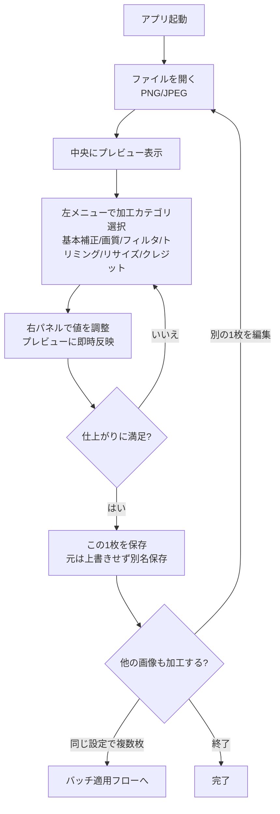
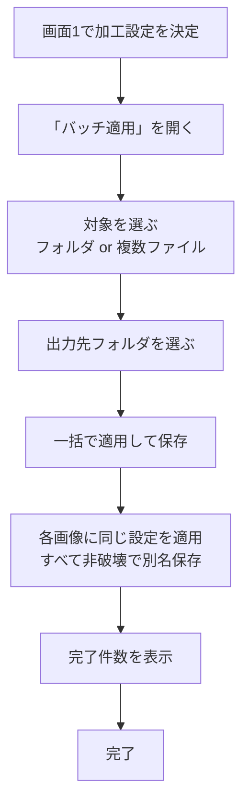

# User Flow — FF14 スクリーンショット加工ツール（mvp）

利用者は制作者本人。中心的な流れは「1枚を開いて加工 → 保存」、および「その設定を複数枚へ一括適用」[intent-statement][Q3]。

## Happy Path: 単体編集フロー



テキストフォールバック（単体編集）: 起動 → 画像を開く → プレビュー表示 → 左メニューで加工を選ぶ → 右で調整（即時反映）→ 満足するまで繰り返し → 別名保存 → 続けて別画像/バッチ/終了を選ぶ。

## Happy Path: バッチ適用フロー



テキストフォールバック（バッチ）: 画面1で加工を決める → 「バッチ適用」を開く → フォルダ/複数ファイルを選ぶ → 出力先を選ぶ → 一括適用して保存 → 全件を非破壊保存 → 完了件数表示。

## Information Architecture（情報の階層）

```
アプリ
├─ ツールバー（開く / 保存 / バッチ適用）
├─ 加工メニュー（左）
│   ├─ 基本補正（明るさ・コントラスト・彩度）
│   ├─ 画質調整（シャープ・ぼかし・ノイズ除去）
│   ├─ フィルタ／プリセット
│   ├─ トリミング
│   ├─ リサイズ
│   └─ クレジット／ウォーターマーク
├─ プレビュー（中央・即時反映）
├─ 調整パネル（右・選択カテゴリの値）
└─ ステータスバー（元ファイル / 出力先 / 保存）
```

## Assumptions & Open Questions

None.
