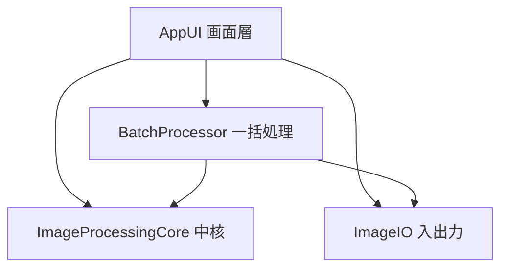

# Component Catalogue — FF14 スクリーンショット加工ツール（mvp）

論理的な構成部品（書くコード）を定義する。依存方向は一方向 `AppUI → ImageProcessingCore → ImageIO`、`BatchProcessor → {ImageProcessingCore, ImageIO}`。デプロイ形態・技術スタックはここでは決めない [team-practices]。

## Part A — Component Catalogue (machine-readable)

```yaml
components:
  - name: AppUI
    summary: 画面・入力を担当し、加工処理は core に委譲するプレゼンテーション層
    behaviour: >
      メインウィンドウ（左メニュー・中央プレビュー・右調整パネル・下部ステータス）、
      クレジット設定、バッチ適用ダイアログを提供する。左メニューのカテゴリ選択で右パネルを
      切り替え、スライダー等の操作値を EditSettings として ImageProcessingCore に渡し、
      返ってきた結果画像をプレビューに即時反映する。保存/バッチ実行の起点となるが、
      画像処理・ファイル入出力のロジックは一切持たない（GUIのみ）。エラーは core/io から
      受け取り、日本語のユーザー向けメッセージに変換して表示する。
    responsibilities:
      - 画面描画とユーザー入力の受付
      - 操作値から EditSettings を構築し core に渡す
      - プレビュー表示・進捗表示・エラーメッセージ表示・リセット操作
    depends_on:
      - component: ImageProcessingCore
        interaction: EditSettings を渡して加工結果画像を得る／プレビュー用に適用する
        style: sync
      - component: ImageIO
        interaction: 画像を開く／単体の保存を依頼する
        style: sync
      - component: BatchProcessor
        interaction: 現在の EditSettings と対象一覧を渡して一括処理を依頼し、進捗・集計を受け取る
        style: sync
    dependents: []
    external_dependencies:
      - name: GUI framework (未確定)
        kind: other
        purpose: ウィンドウ・ウィジェット描画（スタック確定後に選定）
    entities:
      - name: ImageDocument
        identifier: sourcePath
        attributes: [sourcePath, format, width, height, isModified]
        references:
          - entity: EditSettings
            owned_by: ImageProcessingCore
            relationship: 各 ImageDocument は1つの EditSettings を編集中に伴う

  - name: ImageProcessingCore
    summary: GUI非依存の画像処理ロジック（補正・画質・フィルタ・トリミング/リサイズ・クレジット合成）
    behaviour: >
      EditSettings を受け取り、入力画像に対し決定的な変換を適用して結果画像を返す純粋ロジック。
      明るさ/コントラスト/彩度、シャープ/ぼかし/ノイズ除去、プリセット適用、トリミング、
      リサイズ、テキストクレジット合成を提供する。恒等パラメータでは入力と一致する。
      組み込みの PresetDefinition 群（mvpは6〜10種）を保持する。GUI も I/O も import しない。
    responsibilities:
      - 各画像変換操作の実装（決定的・副作用なし）
      - EditSettings の定義・保持（単体編集・バッチで共有）
      - 組み込みプリセット定義の保持
    depends_on: []
    dependents:
      - component: AppUI
        interaction: プレビュー・単体加工のために呼ばれる
      - component: BatchProcessor
        interaction: 各画像への設定適用のために呼ばれる
    external_dependencies:
      - name: 画像処理ライブラリ (未確定)
        kind: third-party-api
        purpose: ピクセル操作・フィルタ等の基盤（core/io の内側に薄くラップ）
    entities:
      - name: EditSettings
        identifier: settingsId
        attributes: [brightness, contrast, saturation, sharpen, blur, denoise, presetName, crop, resize, credit]
      - name: PresetDefinition
        identifier: presetName
        attributes: [presetName, description, adjustments]

  - name: ImageIO
    summary: PNG/JPEG の読み込み・フォーマット判定・非破壊の安全な書き出し
    behaviour: >
      指定パスの画像を未検証データとして安全にデコードし、フォーマット（PNG/JPEG）を判定する。
      破損・非対応・0バイトは型付きエラーで返す（握りつぶさない）。保存は元画像を上書きせず、
      同フォルダに接尾辞付き・元と同形式で、一時ファイル→リネームのアトミック方式で書き出す。
      途中失敗で中途半端な出力を残さない。
    responsibilities:
      - 画像の読み込みとフォーマット判定（安全なデコード）
      - 非破壊・アトミックな書き出し（出力パス生成含む）
      - 入出力エラーの型付き表現
    depends_on: []
    dependents:
      - component: AppUI
        interaction: 開く／単体保存
      - component: BatchProcessor
        interaction: 各対象の読み込み・保存
    external_dependencies:
      - name: 画像処理ライブラリ (未確定)
        kind: third-party-api
        purpose: エンコード/デコード
      - name: ローカルファイルシステム
        kind: other
        purpose: 画像ファイルの読み書き（ローカル完結）
    entities: []

  - name: BatchProcessor
    summary: 1つの EditSettings を複数ファイルに適用し、成功/失敗を集計する
    behaviour: >
      対象ファイル一覧（フォルダ展開または複数選択）と1つの EditSettings を受け取り、
      各ファイルを ImageIO で読み込み、ImageProcessingCore で加工し、ImageIO で非破壊保存する。
      1件の失敗（破損・非対応・保存失敗）はスキップして続行し、成功件数・失敗件数を集計する
      （n+m=対象総数）。全件失敗でもクラッシュしない。進捗（処理済み/総数）を通知する。
      途中キャンセルは提供しない（mvp）。
    responsibilities:
      - 対象一覧の列挙と反復処理
      - 部分失敗のスキップ継続と成功/失敗の集計
      - 進捗の通知
    depends_on:
      - component: ImageProcessingCore
        interaction: 各画像へ EditSettings を適用
        style: sync
      - component: ImageIO
        interaction: 各対象の読み込み・非破壊保存
        style: sync
    dependents:
      - component: AppUI
        interaction: バッチ適用ダイアログから起動される
    external_dependencies: []
    entities:
      - name: BatchJob
        identifier: batchJobId
        attributes: [targetPaths, outputDir, successCount, failureCount, processedCount]
        references:
          - entity: EditSettings
            owned_by: ImageProcessingCore
            relationship: 各 BatchJob は1つの EditSettings を全対象に適用する
```

## Part B — Human-readable view

### Component Diagram



テキストフォールバック: AppUI は ImageProcessingCore・ImageIO・BatchProcessor を呼ぶ。BatchProcessor は ImageProcessingCore と ImageIO を呼ぶ。core と io は他を呼ばない（依存は一方向）。

### Component Summary

| Component | Purpose | Depends On | Dependents | Entities Owned |
|-----------|---------|-----------|-----------|----------------|
| AppUI | 画面・入力、処理は委譲 | ImageProcessingCore, ImageIO, BatchProcessor | — | ImageDocument |
| ImageProcessingCore | GUI非依存の画像処理ロジック | — | AppUI, BatchProcessor | EditSettings, PresetDefinition |
| ImageIO | PNG/JPEG読み書き・非破壊保存 | — | AppUI, BatchProcessor | — |
| BatchProcessor | 複数枚に設定適用・集計 | ImageProcessingCore, ImageIO | AppUI | BatchJob |

### Entity Ownership

| Entity | Owning Component | Identifier | Attributes | References |
|--------|-----------------|-----------|-----------|-----------|
| ImageDocument | AppUI | sourcePath | sourcePath, format, width, height, isModified | EditSettings (ImageProcessingCore) |
| EditSettings | ImageProcessingCore | settingsId | brightness, contrast, saturation, sharpen, blur, denoise, presetName, crop, resize, credit | — |
| PresetDefinition | ImageProcessingCore | presetName | presetName, description, adjustments | — |
| BatchJob | BatchProcessor | batchJobId | targetPaths, outputDir, successCount, failureCount, processedCount | EditSettings (ImageProcessingCore) |

### External Dependencies

| Component | Dependency | Kind | Purpose |
|-----------|-----------|------|---------|
| AppUI | GUI framework (未確定) | other | ウィンドウ・ウィジェット描画 |
| ImageProcessingCore | 画像処理ライブラリ (未確定) | third-party-api | ピクセル操作・フィルタ |
| ImageIO | 画像処理ライブラリ (未確定) | third-party-api | エンコード/デコード |
| ImageIO | ローカルファイルシステム | other | 画像ファイルの読み書き |

### Rationale

| Component | なぜ独立した部品か | Alternatives Rejected |
|-----------|------------------|----------------------|
| AppUI | 変更頻度が高くOS/フレームワーク依存。core から分離することでテスト容易性を確保（確定プラクティス） | — |
| ImageProcessingCore | GUI非依存の純粋ロジックで単体テスト対象（80%カバレッジ層）。関心が明確に異なる | — |
| ImageIO | 副作用（ファイルI/O）を1箇所に閉じ込め、非破壊・安全書き出しを保証。core を純粋に保つ | — |
| BatchProcessor | 反復・集計・部分失敗ハンドリングという単体編集と異なるライフサイクル・関心。core/io を再利用 | BatchProcessor を core に含める案（Q1-B）は、集計・反復という別関心を core の純粋変換に混ぜるため却下 [Q1] |

## Assumptions & Open Questions

- 各エンティティの属性の型・制約は Functional Design（entities.md）で確定する（本ステージは所有と形のみ）。
- 画像処理ライブラリ・GUIフレームワークの具体名はスタック確定後（Units Generation / Functional Design）。
