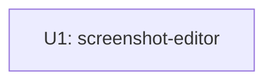

# Unit Dependency DAG — FF14 スクリーンショット加工ツール（mvp）

## Dependency Graph

単一ユニットのため、ユニット間の依存はない（1ノード・エッジなし）。



テキストフォールバック: ユニットは U1（screenshot-editor）の1つのみで、他ユニットへの依存はない。

## Integration Points

- ユニット間の統合点はない（単一ユニット）。ユニット内部のコンポーネント間連携（ui→core→io、Batch→core/io）は components.md の依存図で定義済み。

## Parallel Development Opportunities

- 単一ユニットのため、ユニット単位の並行開発機会はない。ユニット内では、GUI非依存の ImageProcessingCore / ImageIO を先に実装・テストし、AppUI・BatchProcessor を後続で組み上げることが可能（順序はDelivery Planningで決定）。

## Machine-readable Edge Block

```yaml
units:
  - name: screenshot-editor
    kind: ui
    depends_on: []
```

## Assumptions & Open Questions

None.
